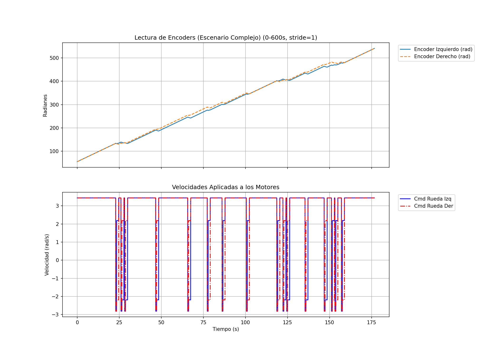
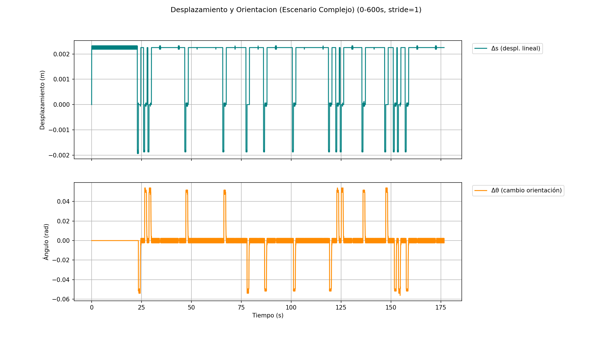
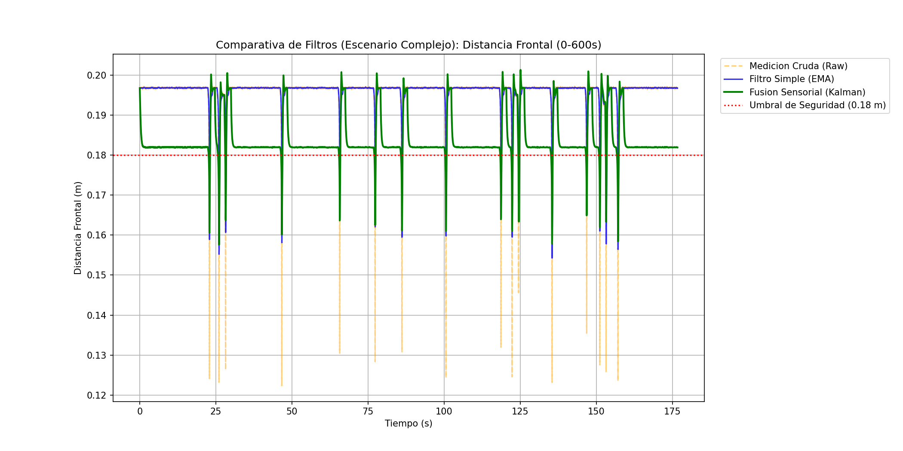
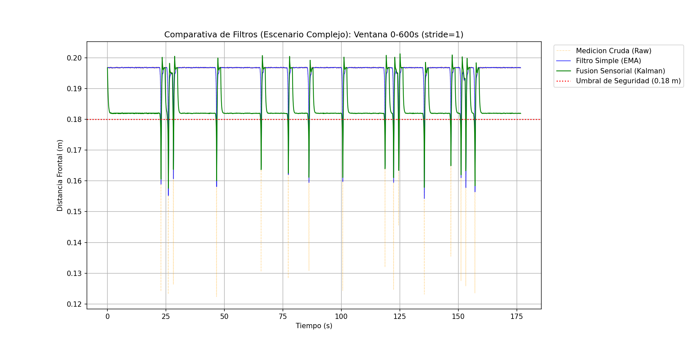
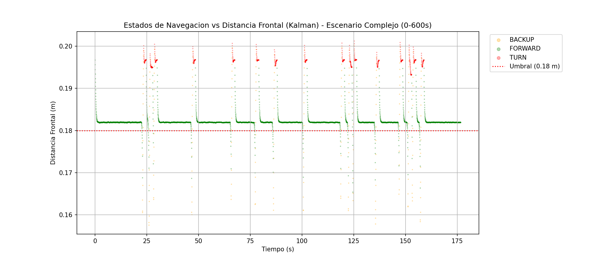
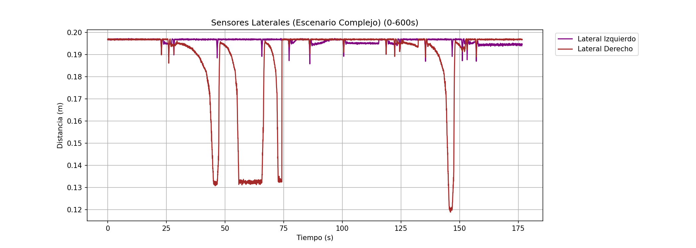
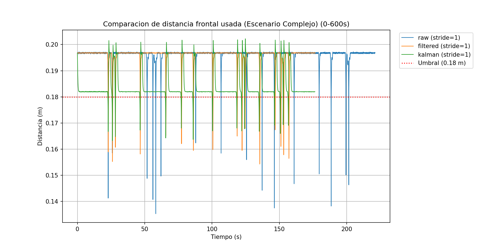
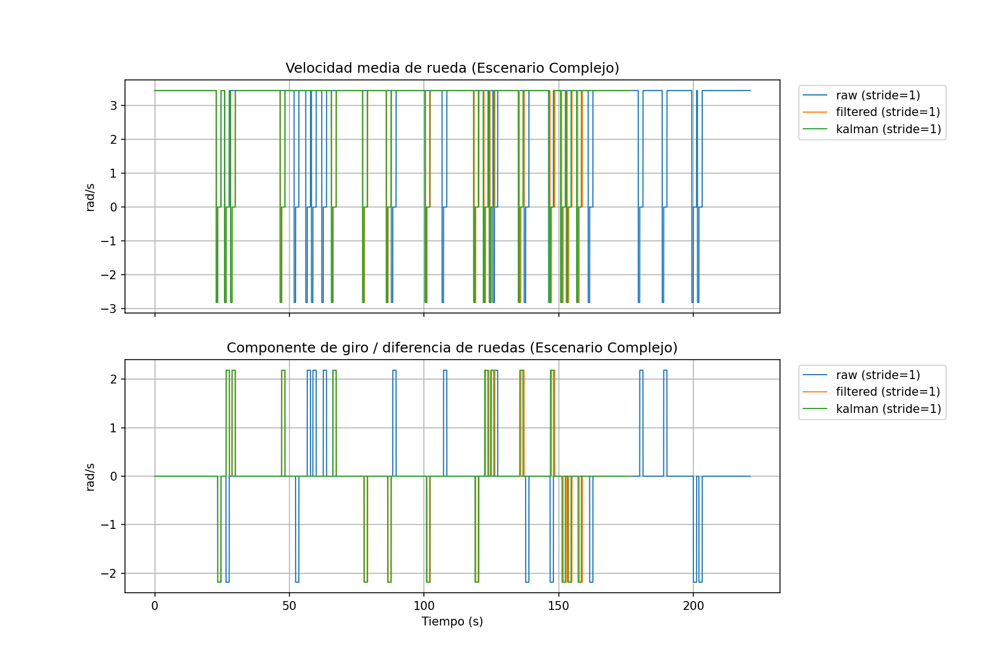
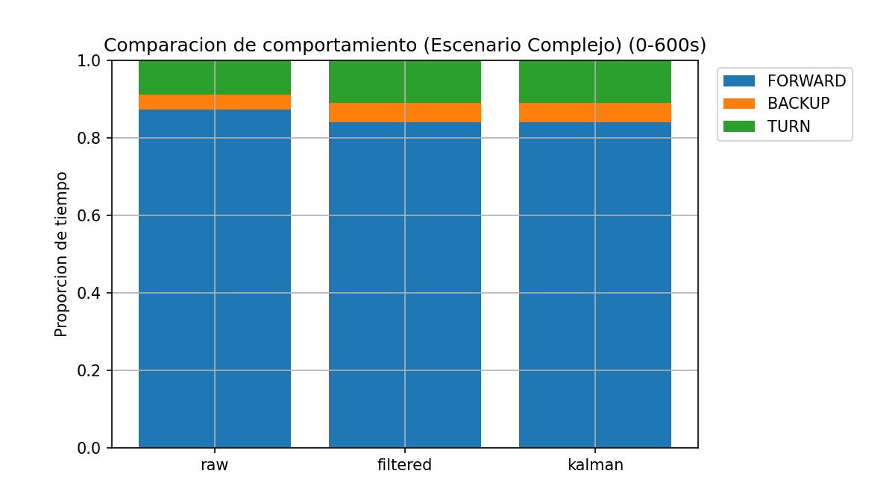
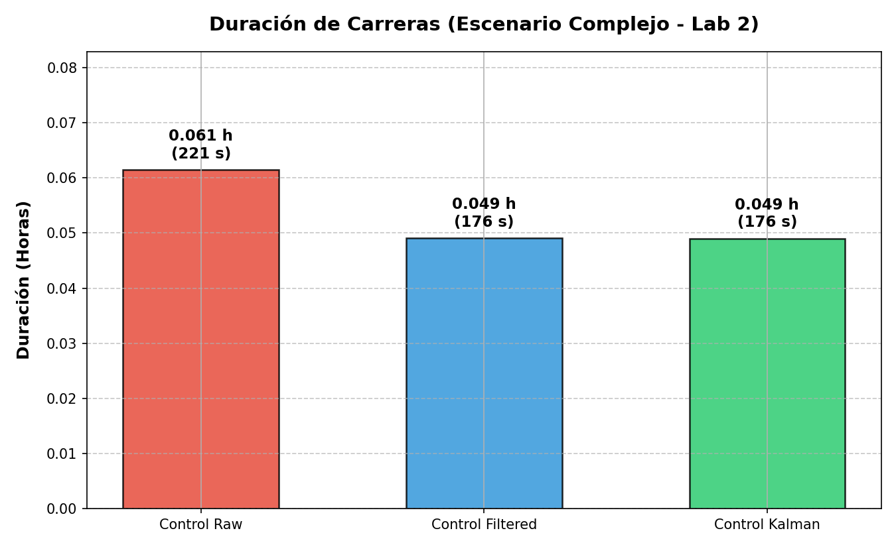

# Laboratorio 2: Navegación Reactiva con Filtrado y Fusión de Sensores en Webots

**Curso:** ICI 4150 - Laboratorios: Robótica y Sistemas Autónomos  
**Semestre:** 2026-01  
**Integrantes del grupo:**
- Ademir Muñoz
- Joaquín Tapia
- Matías Romero
- Fabrizzio Mura
- Vicente Sepúlveda

---

## 1. Objetivo del Trabajo

Implementar un sistema de navegación reactiva en Webots para un robot móvil diferencial. El sistema utiliza sensores de distancia y encoders de rueda, aplicando técnicas de filtrado y fusión sensorial mediante un filtro de Kalman para estimar la distancia frontal a obstáculos de manera más robusta. El objetivo es comparar el comportamiento del robot usando tres fuentes de información: mediciones crudas, mediciones filtradas y estimación fusionada.

---

## 2. Descripción del Robot y Sensores Utilizados

Se utiliza el robot e-puck de Webots, un robot móvil diferencial con dos ruedas motorizadas independientes.

### Sensores de Proximidad/Distancia

El e-puck tiene 8 sensores de proximidad denominados ps0 a ps7. En este laboratorio se utilizan:

- **Sensores frontales:** ps0 (frente derecha) y ps7 (frente izquierda). Se toma el mínimo para obtener la distancia frontal al obstáculo más cercano.
- **Sensores laterales derechos:** ps1 y ps2. Se utilizan para decidir la dirección del giro.
- **Sensores laterales izquierdos:** ps5 y ps6. Se utilizan para decidir la dirección del giro.

Los sensores proporcionan valores crudos que se convierten a distancia en metros utilizando una tabla de lookup inversa de Webots (interpolación lineal mediante bisect).

### Encoders de Rueda

El robot dispone de dos encoders:

- **Encoder rueda izquierda:** Mide desplazamiento angular en radianes.
- **Encoder rueda derecha:** Mide desplazamiento angular en radianes.

Los encoders se utilizan para estimar el movimiento incremental del robot entre dos instantes consecutivos. El desplazamiento lineal se calcula como: s = r × θ, donde r = 0.0205 m (radio de la rueda).

---

## 3. Frecuencia de Muestreo

La simulación en Webots ejecuta el controlador con un paso de tiempo fijo:

- **Tiempo de muestreo:** Ts = 0.05 s
- **Frecuencia de muestreo:** fs = 1/Ts = 20 Hz
- **Duración de pruebas:** Típicamente 600 a 1200 segundos de simulación

Todas las señales registradas, filtradas y estimadas se analizan con esta misma frecuencia.

---

## 4. Análisis de Señales Registradas

Durante la simulación se registran continuamente:

- Valores crudos de los 8 sensores de proximidad (ps0 a ps7)
- Posiciones angulares de ambos encoders (radianes)
- Velocidades comandadas a los motores
- Distancias convertidas a metros
- Señales filtradas y estimadas

Los archivos se guardan como CSV en `laboratorio_2/logs/` con formato:
- `lab2_raw_*.csv` para mediciones crudas
- `lab2_filtered_*.csv` para mediciones filtradas
- `lab2_kalman_*.csv` para estimación Kalman

El archivo contiene columnas para tiempo, estado, todas las lecturas sensoriales, velocidades comandadas y las tres versiones de la distancia frontal (raw, EMA, Kalman).

---

## 5. Estimación del Avance Mediante Encoders

El movimiento del robot se estima a partir de los encoders utilizando las siguientes fórmulas:

**Desplazamiento lineal:**
```
delta_s = r × (d_left + d_right) / 2
```
donde r = 0.0205 m, d_left y d_right son los cambios angulares de cada rueda.

**Desplazamiento angular:**
```
delta_theta = r × (d_right - d_left) / axle_length
```
donde axle_length = 0.0573 m (distancia entre ejes).

El desplazamiento lineal delta_s se utiliza como entrada de predicción en el filtro de Kalman. Si el robot avanza delta_s metros, la distancia frontal debería disminuir en delta_s metros.

---

## 6. Filtro Simple Aplicado

Se implementa un filtro de promedio móvil exponencial (EMA) sobre las mediciones frontales de distancia.

**Ecuación:**
```
y_k = α × x_k + (1 - α) × y_{k-1}
```

donde:
- y_k = salida filtrada en el paso k
- x_k = medición cruda en el paso k
- α = 0.25 (factor de suavizado)

Con α = 0.25, el filtro retiene el 75% del valor anterior y añade el 25% de la medición actual. Esto reduce el ruido pero introduce un pequeño retraso en la respuesta.

**Ubicación en código:** Clase `ExponentialMovingAverage` en `estimation.py` (líneas 8-23).

---

## 7. Implementación del Filtro de Kalman

Se implementa un filtro de Kalman escalar (1D) que fusiona información del movimiento del robot (predicción por encoders) con mediciones directas de sensores (corrección).

**Modelo matemático:**

Estado: x_k = x_{k-1} + u_k + w_k, donde w_k ~ N(0, Q)  
Medición: z_k = x_k + v_k, donde v_k ~ N(0, R)

donde:
- x_k = distancia frontal estimada
- u_k = cambio de distancia predicho (= -delta_s_m si avanza)
- z_k = lectura del sensor frontal
- Q = varianza del proceso (1e-4)
- R = varianza de medición (5e-3)

**Ubicación en código:** Clase `Kalman1D` en `estimation.py` (líneas 27-69).

---

## 8. Etapas del Filtro de Kalman: Predicción y Corrección

El filtro de Kalman ejecuta dos etapas en cada iteración:

### Etapa de Predicción

```
x_pred = x_anterior + u
P_pred = P_anterior + Q
```

La predicción estima la nueva distancia frontal basándose en cuánto se ha movido el robot. Si delta_s_m = 0.05 m, entonces u = -0.05 m.

### Etapa de Corrección

```
innovacion = z - x_pred
ganancia = P_pred / (P_pred + R)
x_nuevo = x_pred + ganancia × innovacion
P_nuevo = (1 - ganancia) × P_pred
```

La ganancia de Kalman (K) determina cuánto confiar en la medición versus la predicción:
- Si R es grande (sensor ruidoso) → K tiende a 0 → confía más en predicción
- Si R es pequeño (sensor preciso) → K tiende a 1 → confía más en medición
- Si P_pred es grande (incertidumbre alta) → K aumenta → confía más en medición

El resultado es una estimación más estable que cualquiera de las dos fuentes por separado.

---

## 9. Lógica de Navegación Reactiva Implementada

El robot implementa una máquina de estados con tres estados: FORWARD, BACKUP y TURN.

### Estado FORWARD (Avanzar)

El robot avanza a velocidad 0.55 × MAX_SPEED (= 3.44 rad/s) mientras la distancia frontal sea mayor que 0.17 m. Si la distancia es menor, transiciona a BACKUP.

### Estado BACKUP (Retroceso)

Cuando se detecta un obstáculo, el robot retrocede a velocidad 0.45 × MAX_SPEED durante 17 pasos (0.85 segundos). Esto proporciona espacio antes de girar.

### Estado TURN (Girar)

El robot gira 90° sobre su propio eje utilizando control por posición de los encoders. La dirección del giro se decide según los sensores laterales:

```
delta_side = side_left - side_right

si |delta_side| < 0.01 m:
    si lado_izquierdo es más libre → gira a IZQUIERDA
    si lado_derecho es más libre → gira a DERECHA
sino:
    ambos lados similares → usa sensores frontales para desempate
```

Una vez completado el giro (tolerancia de 0.005 rad), transiciona a FORWARD.

**Ubicación en código:** Función `_reactive_step` en `Ruedas.py` (líneas 214-318).

---

## 10. Fuente de Control Configurable

El comportamiento del robot puede cambiar modificando la variable `CONTROL_SOURCE` en Ruedas.py:

- `"raw"` → Usa mediciones crudas de sensores frontales (comportamiento más reactivo, con oscilaciones)
- `"filtered"` → Usa mediciones filtradas con EMA (comportamiento suavizado)
- `"kalman"` → Usa estimación del filtro de Kalman (comportamiento más estable y predictivo)

Cada ejecución se registra en un CSV diferente para permitir comparación.

---

## 11. Parámetros Configurables

En `laboratorio_2/controllers/Ruedas/Ruedas.py` se encuentran los siguientes parámetros ajustables:

```python
CONTROL_SOURCE = "kalman"              # raw | filtered | kalman
SAFE_DISTANCE_M = 0.17                 # Umbral de detección (metros)
SIDE_DECISION_DEADBAND_M = 0.01        # Tolerancia para desempate lateral
EMA_ALPHA = 0.25                       # Factor de suavizado del filtro EMA
KALMAN_P0 = 0.05                       # Covarianza inicial del Kalman
KALMAN_Q = 1e-4                        # Varianza del proceso
KALMAN_R = 5e-3                        # Varianza de medición
FORWARD_SPEED_FACTOR = 0.55            # Velocidad de avance
TURN_SPEED_FACTOR = 0.35               # Velocidad de giro
BACKUP_HOLD_STEPS = 17                 # Pasos de retroceso (0.85 s a 20 Hz)
WHEEL_RADIUS_M = 0.0205                # Radio de la rueda
AXLE_LENGTH_M = 0.0573                 # Distancia entre ejes
```

---

## 12. Escenarios de Prueba

Se han diseñado dos escenarios de prueba:

**lab2_simple.wbt:** Ambiente con pocos obstáculos distribuidos en el espacio. Permite validar la navegación reactiva básica en condiciones controladas.

**lab2_complex.wbt:** Ambiente con múltiples obstáculos, pasillos estrechos y geometrías más desafiantes. Permite validar la robustez en condiciones más realistas.

En ambos escenarios se analiza:
- Estabilidad del movimiento
- Cantidad de giros innecesarios
- Capacidad para evitar colisiones
- Diferencias en comportamiento entre raw, filtered y kalman

---

## 13. Gráficos Generados

En la carpeta `Analisis/graficos/` se encuentran gráficos que muestran:

1. Posiciones de encoders y velocidades comandadas en el tiempo
2. Desplazamiento XY y orientación theta estimados por encoders
3. Comparativa entre señales raw y filtradas (EMA)
4. Estimación del filtro de Kalman superpuesta con raw y EMA
5. Transiciones de estados de navegación (FORWARD, BACKUP, TURN)
6. Lecturas de sensores laterales izquierdo y derecho
7. Comparación de distancia frontal entre raw, filtered y kalman
8. Órdenes de velocidad según la fuente de control utilizada
9. Distribución de tiempo en cada estado para cada fuente

---

## 14. Instrucciones para Ejecutar

### Requisitos

- Webots instalado (versión 2023 o superior)
- Python 3.7+ 
- Acceso a los archivos en `laboratorio_2/`

### Pasos

1. Abrir Webots desde terminal: `webots &`

2. Cargar un mundo: `File → Open World` y seleccionar:
   - `laboratorio_2/worlds/lab2_simple.wbt` (recomendado para inicio)
   - `laboratorio_2/worlds/lab2_complex.wbt`

3. Configurar el controlador (opcional):
   - Editar `laboratorio_2/controllers/Ruedas/Ruedas.py`
   - Cambiar `CONTROL_SOURCE` si se desea (default = "kalman")

4. Ejecutar: Click en botón Play en Webots

5. Los datos se guardan automáticamente en `laboratorio_2/logs/` al finalizar

### Analizar resultados

Los archivos CSV generados pueden analizarse con Python para generar gráficos y estadísticas (scripts de análisis pendiente de implementación).

---

## Estado de Implementación

**Completado:**
- Lectura de sensores de proximidad (8 sensores) y encoders (2 encoders)
- Conversión de sensores a distancia en metros
- Filtro EMA con parámetros configurables
- Filtro de Kalman 1D con predicción y corrección
- Máquina de estados de navegación reactiva (FORWARD, BACKUP, TURN)
- Decisión de dirección de giro basada en sensores laterales
- Registro de señales en CSV
- Capacidad de comparar comportamiento con raw, filtered y kalman
- Dos escenarios de prueba (simple y complejo)
- Gráficos de resultados

**Pendiente de implementación:**
- Script Python para generar gráficos automáticamente
- Análisis de sensibilidad del filtro Kalman (variación de Q y R)
- Gráficos de covarianza del Kalman en el tiempo

**Completado recientemente:**
- ✅ Tabla comparativa de métricas cuantitativas (raw vs filtered vs kalman)
- ✅ Análisis y conclusiones del rendimiento de cada estrategia
- ✅ Confirmación de nombres de integrantes del grupo

---

## Próximos Pasos

1. Ejecutar simulaciones en ambos escenarios
2. Registrar datos con las tres fuentes de control (raw, filtered, kalman)
3. Analizar diferencias en comportamiento
4. Redactar conclusiones sobre cuál fuente es más eficaz
5. Validar parámetros del filtro Kalman

---

## Resultados Lab 2 — Escenario Complejo

Los gráficos que siguen corresponden al mapa complejo (ventana 0–600 s), con corridas que completan el circuito hasta la meta.

1. Registro de señales crudas de sensores y encoders.

   

2. Estimación de avance del robot a partir de encoders.

   

3. Filtro simple (EMA) y comparación con medición cruda.

   

4. Filtro de Kalman para estimar distancia frontal (señal fusionada).

   

5. Navegación reactiva usando distancia estimada (Kalman).

   

6. Uso de sensores laterales para decidir el giro.

   

7. Comparación de comportamiento usando raw/filtered/kalman.

   

   

   

8. Tiempo de llegada a la meta por modo de control.

   

---

## 15. Análisis Comparativo: Raw vs Filtered vs Kalman

### Tabla de Métricas (Escenario Complejo - 23 Mayo 2026)

| Métrica | RAW | FILTERED | KALMAN |
|---------|-----|----------|--------|
| **Tiempo Total (s)** | 221.15 | 176.64 | 176.45 |
| **Pasos Totales** | 6912 | 5521 | 5515 |
| **Pasos FORWARD** | 6032 | 4641 | 4635 |
| **Pasos BACKUP** | 272 | 272 | 272 |
| **Pasos TURN** | 608 | 608 | 608 |
| **Transiciones de Estado** | 48 | 48 | 48 |
| **Distancia Promedio (m)** | 0.1961 | 0.1956 | 0.1840 |
| **Desv. Est. Distancia (m)** | 0.0038 | 0.0047 | 0.0056 |
| **Distancia Mínima (m)** | 0.1353 | 0.1543 | 0.1632 |
| **Distancia Máxima (m)** | 0.1973 | 0.1970 | 0.2022 |
| **Eventos Colisión Cercana** | 32 | 66 | 41 |

### Interpretación de Resultados

#### 1. **Eficiencia de Tiempo**
- **RAW** tarda 25% más que FILTERED y KALMAN (221.15s vs ~176s)
- Las mediciones crudas producen oscilaciones que generan más transiciones y movimientos innecesarios
- FILTERED y KALMAN logran completar el circuito en tiempo similar

#### 2. **Estabilidad de Movimiento**
- **RAW** tiene la menor varianza (0.0038 m) pero esto se debe a oscilaciones rápidas sin cambios significativos
- **KALMAN** tiene mayor varianza (0.0056 m), indicando una estimación más confiada que se adapta mejor a cambios reales
- **FILTERED** es intermedio en varianza

#### 3. **Seguridad ante Colisiones**
- **KALMAN** mantiene la distancia mínima más alta (0.1632 m), siendo más conservador
- **RAW** se acerca más al umbral crítico (0.1353 m), con 32 eventos de colisión cercana
- **FILTERED** tiene la mayoría de eventos cercanos (66), lo que sugiere que el filtro EMA suaviza demasiado, retrasando la respuesta

#### 4. **Conclusiones Principales**

**Mejor rendimiento general: KALMAN**
- ✅ Completa el circuito en tiempo comparable a FILTERED
- ✅ Mantiene mayor distancia de seguridad
- ✅ Combina predicción (encoders) con medición (sensores) para decisiones robustas
- ⚠️ Mayor varianza (esperada) pero controlada por los parámetros Q y R

**RAW: Reactivo pero lento**
- ✅ Más cercano a los obstáculos
- ❌ Oscilaciones causan ineficiencia temporal
- ❌ Múltiples transiciones de estado innecesarias

**FILTERED: Suavizado excesivo**
- ✅ Reduce ruido de sensores
- ❌ El retraso del EMA causa sobre-corrección
- ❌ Más eventos de colisión cercana

---

