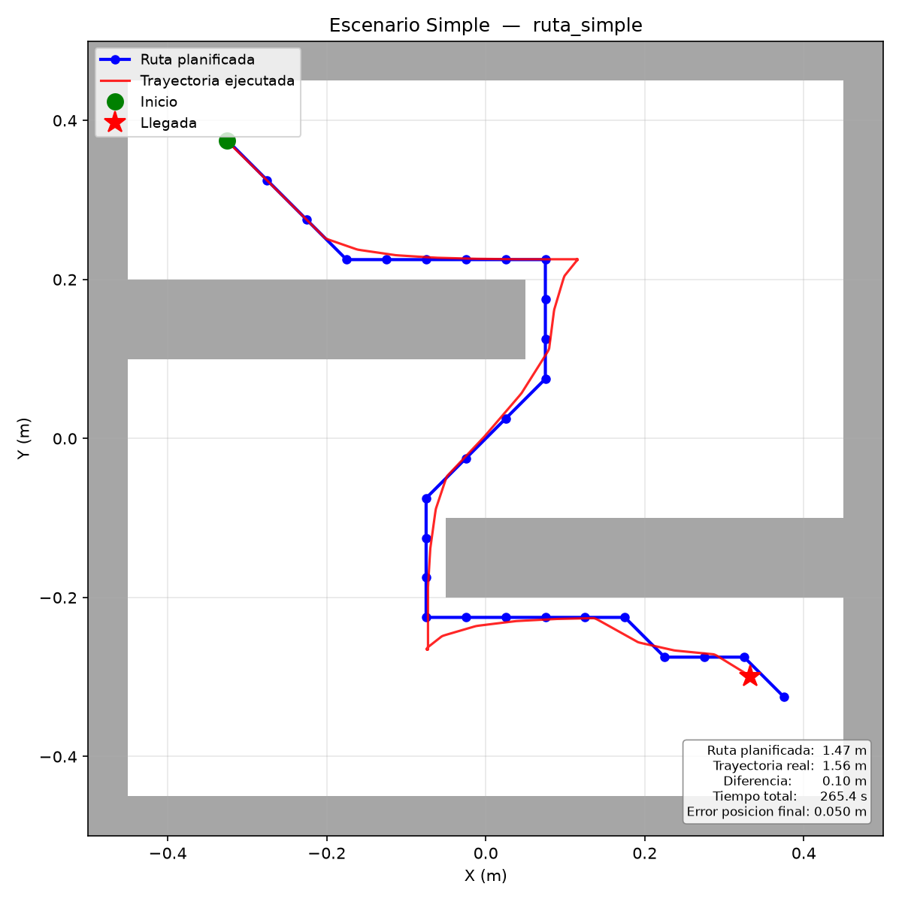
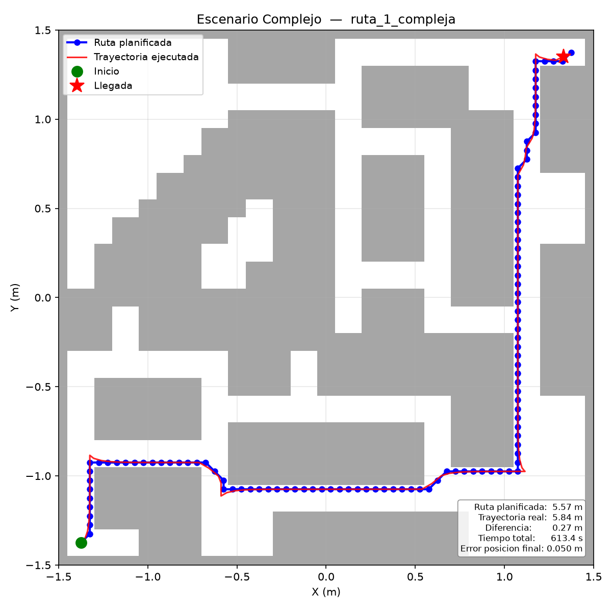
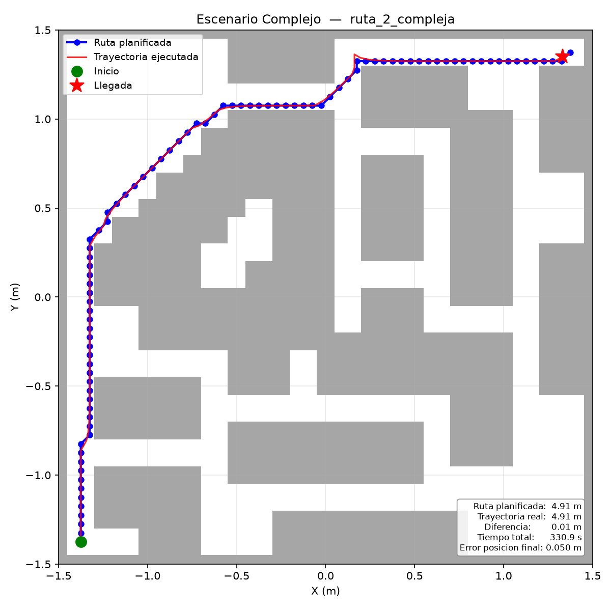

# Proyecto Final: Navegación Autónoma con Planificación de Rutas (A*) en Webots

**Curso:** ICI 4150 - Robótica y Sistemas Autónomos
**Semestre:** 2026-01
**Línea seleccionada:** Línea A — Planificación de rutas con A* sobre grilla de ocupación

**Integrantes del grupo:**
- Ademir Muñoz
- Joaquín Tapia
- Matías Romero
- Fabrizzio Mura
- Vicente Sepúlveda

---

## 1. Objetivo del Proyecto

Hacer que un robot pueda moverse solo desde un punto de partida hasta una meta dentro de un espacio con obstáculos. Para lograrlo, el robot primero calcula la mejor ruta posible usando el algoritmo A*, y luego la sigue paso a paso usando sus ruedas y sensores. Si en el camino detecta que está muy cerca de un muro, puede detenerse y corregir su trayectoria.

## 2. Robot, Sensores y Actuadores

Se usa el robot **e-puck** de Webots, que tiene dos ruedas independientes.

| Componente | Para qué se usa |
|---|---|
| 2 motores de rueda | Mover al robot: avanzar, girar y seguir la ruta calculada |
| 2 encoders de rueda | Saber cuánto giró cada rueda y así estimar dónde está el robot |
| 8 sensores de proximidad IR (ps0-ps7) | Detectar paredes y obstáculos cercanos |

El robot mide 7.4 cm de diámetro. El paso de simulación es 50 ms (20 veces por segundo).

## 3. Escenarios de Prueba

Ambos escenarios tienen una marca roja en el piso (punto de partida) y una marca verde (meta).

**Escenario simple (`worlds/lab2_simple.wbt`):**
Arena de 1x1 m con dos muros que obligan al robot a hacer una curva en "S". El robot parte de (-0.35, 0.35) y debe llegar a (0.35, -0.35). La ruta calculada tiene 11 puntos intermedios y mide 1.47 m.

**Escenario complejo (`worlds/escenario_complejo.wbt`):**
Arena de 3x3 m con 52 bloques distribuidos como un laberinto. El robot parte de la esquina inferior-izquierda (-1.375, -1.375) y debe llegar a la esquina superior-derecha (1.375, 1.375). La ruta calculada tiene 14 puntos intermedios y mide 4.91 m.

## 4. Algoritmo Implementado

### 4.1. Cómo se representa el entorno

Antes de que el robot empiece a moverse, el controlador lee el archivo del mundo de Webots y construye un mapa cuadriculado del entorno. Cada casilla del mapa mide 5x5 cm y puede estar libre u ocupada. Los obstáculos se marcan con un margen extra de 6 cm alrededor para que el robot no pase demasiado cerca de las paredes.

El controlador detecta automáticamente qué escenario se está corriendo y selecciona el mapa y los puntos de inicio/meta correspondientes.

### 4.2. Planificación de la ruta con A*

Una vez construido el mapa, el algoritmo A* busca el camino más corto desde el inicio hasta la meta. Puede moverse en las 8 direcciones (horizontal, vertical y diagonal), pero no corta esquinas de muros. Si el punto de inicio o la meta quedan muy cerca de un obstáculo, el algoritmo busca el punto libre más cercano.

La ruta se simplifica eliminando puntos que estén en línea recta, de modo que el robot solo tiene que pasar por los puntos donde realmente debe cambiar de dirección.

La ruta calculada se guarda en la carpeta `logs/` para poder revisarla después.

### 4.3. Seguimiento de la ruta

El robot sigue la lista de puntos intermedios uno por uno. En cada paso:

1. Calcula hacia qué lado debe girar para apuntar al próximo punto.
2. Si el giro necesario es grande (más de 75°), se detiene completamente y gira en el lugar antes de avanzar.
3. Una vez alineado, avanza hacia el punto. Cuando está suficientemente cerca, pasa al siguiente.
4. Al llegar al último punto, se detiene.

### 4.4. Protección contra choques

Si el sensor frontal detecta una pared a menos de 17 cm, el robot entra en modo de seguridad: retrocede un poco, gira hacia el lado más libre según los sensores laterales, y luego retoma la ruta planificada.

### 4.5. Pseudocódigo

```
INICIO
  Detectar qué mundo está cargado en Webots
  Cargar el mapa del entorno desde el archivo .wbt
  Calcular la ruta con A* desde el inicio hasta la meta
  Guardar la ruta en logs/

  MIENTRAS la simulación esté activa:
    Leer sensores y encoders
    Actualizar estimación de posición (odometría)
    Estimar distancia frontal con filtro Kalman

    SI hay pared a menos de 17 cm:
      Retroceder → girar al lado libre → retomar ruta
    SI NO:
      Avanzar hacia el próximo punto de la ruta
      SI llegó al punto: pasar al siguiente

    SI llegó al último punto:
      Detener el robot → META ALCANZADA
    Registrar datos en CSV
FIN
```

## 5. Relación con los Laboratorios 1 y 2

| Laboratorio | Qué se reutiliza | En qué archivo |
|---|---|---|
| Lab 1 — movimiento | Control diferencial: cómo convertir velocidades de rueda en movimiento recto y giro | `wheel.py`, `Ruedas.py` |
| Lab 1 — odometría | Ecuaciones para estimar la posición (x, y, ángulo) a partir de cuánto giró cada rueda | `estimation.py`, `robot.py` |
| Lab 2 — sensores | Lectura de los 8 sensores IR y conversión a metros | `proximity.py` |
| Lab 2 — filtrado | Filtro de Kalman sobre la distancia frontal para suavizar las lecturas | `estimation.py` |
| Lab 2 — evasión | Lógica de retroceso y giro cuando el sensor detecta un obstáculo | `Ruedas.py` |

En el proyecto, la odometría del Lab 1 deja de ser solo un registro y pasa a ser la forma en que el robot sabe dónde está dentro de la ruta planificada. El filtro del Lab 2 deja de controlar al robot directamente y pasa a ser una capa de seguridad que decide cuándo esquivar.

## 6. Instrucciones para Ejecutar

Requisitos: Webots R2023 o superior y Python 3.10+.

1. Abrir Webots y cargar uno de los mundos: `laboratorio_final/worlds/lab2_simple.wbt` o `escenario_complejo.wbt` (File → Open World).
2. Presionar Play. El controlador detecta el mundo automáticamente, no hay que cambiar nada entre escenarios.
3. La consola muestra el mapa cargado, la ruta planificada y los mensajes de estado. Al llegar a la meta aparece `META ALCANZADA` con la posición final y el tiempo.
4. Al terminar se generan en `laboratorio_final/logs/`:
   - `final_<fecha>.csv` — registro paso a paso de posición, sensores y comandos.
   - `final_route_<fecha>.csv` — los puntos de la ruta planificada.
   - `final_map_<fecha>.txt` — el mapa en texto con la ruta dibujada.

## 7. Descripción del Código

### Archivos principales

| Archivo | Qué hace |
|---|---|
| `Ruedas.py` | Es el controlador principal. Decide en cada instante si el robot debe seguir la ruta, girar en el lugar o esquivar un obstáculo. |
| `world_map.py` | Lee el archivo del mundo de Webots y construye el mapa cuadriculado con todos los obstáculos marcados. |
| `path_planner.py` | Implementa el algoritmo A* que calcula el camino más corto en el mapa. |
| `occupancy_grid.py` | Representa el mapa como una cuadrícula. Sabe qué celdas están libres y cuáles ocupadas. |
| `robot.py` | Agrupa el manejo de motores, encoders y sensores del e-puck en un solo lugar. |
| `estimation.py` | Calcula la posición estimada del robot a partir de los encoders (odometría), y aplica el filtro Kalman a la distancia frontal. |
| `proximity.py` | Lee los 8 sensores de proximidad y los convierte a metros. |
| `wheel.py` | Controla las velocidades de las ruedas. |
| `csv_logger.py` | Guarda todos los datos de cada paso en un archivo CSV para su análisis. |

### Funciones importantes en `Ruedas.py`

**`_plan_route()`** — Llama al algoritmo A* y prepara la lista de puntos que el robot debe seguir. Se ejecuta al inicio y también si el robot necesita recalcular la ruta.

**`_waypoint_step()`** — Se ejecuta en cada paso de la simulación cuando el robot está siguiendo la ruta. Calcula hacia qué lado girar, decide si hacer un giro en el lugar, y avanza al siguiente punto cuando corresponde.

**`_reactive_step()`** — Se activa cuando el sensor frontal detecta una pared muy cerca. El robot retrocede, gira al lado más libre y retoma la ruta.

## 8. Resultados y Métricas

### Escenario simple

| Métrica | Resultado |
|---|---|
| Longitud de ruta planificada | 1.47 m |
| Tiempo hasta la meta | 265.4 s |
| Longitud de trayectoria ejecutada | 1.56 m |
| Diferencia ruta planificada vs ejecutada | +0.10 m |
| Activaciones de capa reactiva | 0 |
| Error de posición final | 0.050 m |
| Corridas exitosas | 1/1 |

### Escenario complejo

Se ejecutaron dos rutas distintas en el laberinto complejo.

| Métrica | Ruta 1 | Ruta 2 |
|---|---|---|
| Longitud de ruta planificada | 5.57 m | 4.91 m |
| Tiempo hasta la meta | 613.4 s | 330.9 s |
| Longitud de trayectoria ejecutada | 5.84 m | 4.91 m |
| Diferencia ruta planificada vs ejecutada | +0.27 m | −0.01 m |
| Activaciones de capa reactiva | 0 | 0 |
| Error de posición final | 0.050 m | 0.050 m |
| Corridas exitosas | 1/1 | 1/1 |

## 9. Evidencias

### Gráficos de ruta planificada vs trayectoria real

A continuación se muestran las rutas calculadas por A* (azul) y las trayectorias que efectivamente ejecutó el robot según la odometría (rojo). En los tres casos el robot alcanzó la meta sin activar la capa reactiva de emergencia.

**Escenario simple**



**Escenario complejo - ruta 1**



**Escenario complejo - ruta 2**



### Otros archivos de evidencia

- El análisis estadístico completo, incluyendo comparativas entre escenarios, evolución temporal, sensores y odometría, está en `Analisis/Analisis_Proyecto_Final.ipynb`.
- Las métricas resumidas se exportan automáticamente a `Analisis/metricas_resumen.csv`.

## 10. Conclusiones y Limitaciones

### Lo que funciona

- El robot navegó de forma autónoma en los tres casos analizados (escenario simple y dos rutas del escenario complejo), alcanzando la meta con un error final de aproximadamente 5 cm.
- El algoritmo A* generó rutas libres de colisiones y el seguimiento de waypoints mantuvo la trayectoria real muy cercana a la planificada (desviación media ≤ 2.5 cm).
- No se activó la capa reactiva de emergencia en ninguna corrida; las lecturas frontales crudas nunca bajaron de 10 cm, por lo que el robot mantuvo margen de seguridad.
- El filtro de Kalman suavizó las lecturas de distancia frontal, estabilizando la percepción durante toda la navegación.

### Limitaciones conocidas

- El robot no sabe exactamente dónde está: solo estima su posición a partir de cuánto giraron sus ruedas. En la ruta compleja 1 se observa una diferencia de +0.27 m entre distancia ejecutada y planificada, probablemente por giros en el lugar y pequeña deriva acumulada.
- Los corredores del escenario complejo son estrechos. Si el margen de seguridad alrededor de los obstáculos es demasiado grande, el planificador puede cerrar algunos pasillos en el mapa y no encontrar ruta.
- La velocidad media es baja (≤ 0.015 m/s) porque el robot se detiene para alinearse antes de cada giro, lo que alarga el tiempo de recorrido, especialmente en la ruta compleja 1 (613 s).

### Posibles mejoras

- Habilitar `USE_GYRO = True` para reducir el error de orientación en giros y mejorar la odometría.
- Implementar un seguidor de ruta tipo pure-pursuit o curvas de suavizado para evitar las paradas en cada waypoint.
- Evaluar distintos valores de `WAYPOINT_TOLERANCE_M` y `HEADING_KP` para acortar el tiempo de recorrido sin sacrificar precisión.

## 11. Estructura del Repositorio

```
laboratorio_final/
├── README.md                        # este informe
├── ProyectoFinal.pdf                # enunciado del proyecto
├── worlds/
│   ├── lab2_simple.wbt              # escenario simple (1x1 m)
│   └── escenario_complejo.wbt       # escenario complejo (3x3 m, laberinto)
├── controllers/Ruedas/
│   ├── Ruedas.py                    # controlador principal
│   ├── world_map.py                 # construye el mapa desde el archivo .wbt
│   ├── path_planner.py              # algoritmo A*
│   ├── occupancy_grid.py            # mapa cuadriculado
│   ├── robot.py                     # manejo del robot (motores, encoders, sensores)
│   ├── estimation.py                # odometría y filtro Kalman
│   ├── proximity.py                 # lectura de sensores IR
│   ├── wheel.py                     # control de ruedas
│   └── csv_logger.py                # registro de datos
├── Analisis/                        # análisis estadístico y gráficos
│   ├── Analisis_Proyecto_Final.ipynb
│   ├── metricas_resumen.csv
│   ├── graficar_corridas.py
│   └── grafico_*.png
└── logs/                            # archivos generados al correr la simulación
```
## 12. Videos de rutas Simple y Compleja 
- **Ruta compleja:** https://drive.google.com/file/d/1gbLmn8-T5ZekhGfHdwwiTFYVOk-_Ie0I/view?usp=sharing
- **Ruta simple:** https://drive.google.com/file/d/1MbFThTrjMhqq_SHTbpCCpoYwOkAvJ_Ts/view?usp=sharing